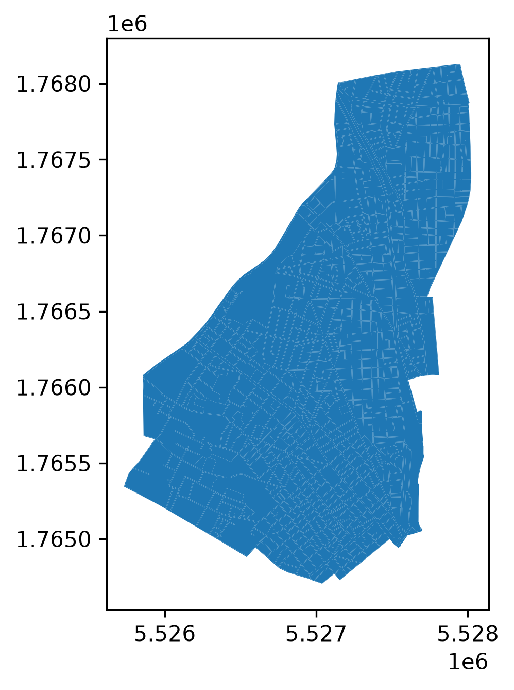

## CWL validity

```{bash}
pixi run --manifest-path ../../lstm-wp3-products/products/hotspots/pixi.toml --as-is cwltool --disable-color --validate ../../lstm-wp3-products/products/hotspots/app/eoap.cwl | cat
```

- Warning is okay, there is no "main" because platforms may manage their main on their own accord

## Setup is valid (Directory + STAC)

This is still ua

```{bash}
tree -n ../../lstm-wp3-products/products/ua/inputs
```

## Can run to produce output

```{bash}
pixi run --manifest-path ../../lstm-wp3-products/products/hotspots/pixi.toml --as-is cwltool --disable-color --outdir ../cwlruns/combined ../../lstm-wp3-products/products/ua/app/eoap.cwl#heatwise_combined --urban_atlas ../../lstm-wp3-products/products/ua/inputs/urban_atlas --hcspots  ../../lstm-wp3-products/products/ua/inputs/hcspots --material_labels ../../lstm-wp3-products/products/ua/inputs/material_labels | cat
```

## Show output

```{bash}
pixi run --as-is  python -c "import geopandas as gpd; import matplotlib.pyplot as plt; gpd.read_file('cwlruns/combined/zeb8irli/datasets_saved/hw_combined_sepolia.gpkg').plot();  plt.savefig('hw_combined_sepolia.png', dpi=300, bbox_inches='tight')"

```




<!-- TODO: Does not work, because the item contains incorrect geometry -->
<!--
```{.bash}
pixi run --as-is  python -c "import geopandas as gpd; import matplotlib.pyplot as plt; gpd.read_file('cwlruns/combined/zeb8irli/datasets_saved/urban_atlas_with_hotspots.json').plot();  plt.savefig('hw_combined_sepolia_geometry.png', dpi=300, bbox_inches='tight')"

```


-->

## CWL contains required fields

## STAC validity

Catalog

```{bash}
pixi run --as-is stac-validator validate --recursive cwlruns/combined/zeb8irli/catalog.json | cat || :
```

## output contains required fields

### Requirement 6: STAC Metadata (rec/app/stac-out-metadata)

> The STAC Catalog created by the Application SHALL include metadata elements for each STAC Item with at least their spatial (geometry, box) and temporal (datetime) properties.

Test validity
```{bash}
pixi run --as-is jq -M 'has("geometry") and has("bbox") and has("properties") and (.properties | has("datetime"))' cwlruns/combined/zeb8irli/datasets_saved/urban_atlas_with_hotspots.json || :
```

Show

```{bash}
pixi run --as-is jq -M '{name: .bbox, properties: .properties}' cwlruns/combined/zeb8irli/datasets_saved/urban_atlas_with_hotspots.json | cat

```

```{bash}
pixi -q run --as-is jq -M '{geometry: .geometry}' cwlruns/combined/zeb8irli/datasets_saved/urban_atlas_with_hotspots.json | head -n 20
```
